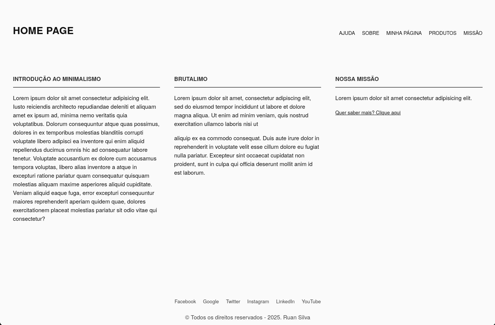

  <h1 align="center">🎨 Minimalismo Brutalista 📝</h1>
    

      
    

  

    
    

## O que é Minimalismo Brutalista? 🤔

Minimalismo Brutalista é um estilo de design que combina elementos do minimalismo e do brutalismo. Onde o minimalismo preza pela simplicidade e o brutalismo preza pela expressão e autenticidade.

## Tecnologias utilizadas 🛠️

- HTML
- CSS
- JavaScript
